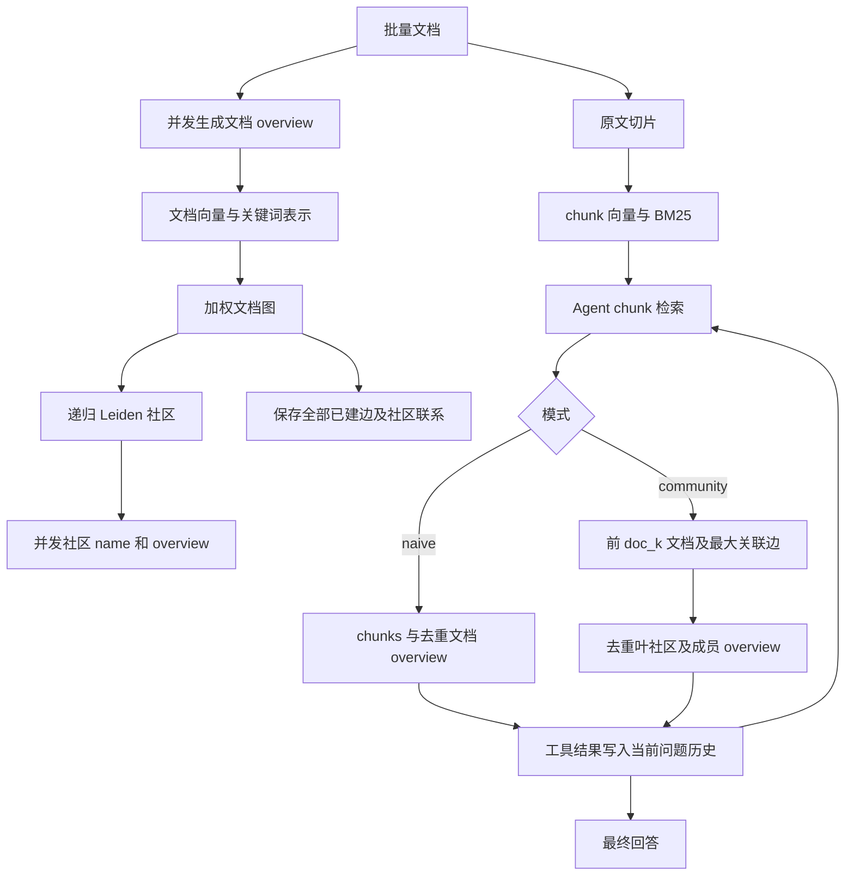

# 实现说明与需求对照

## 1. 总体设计及与 GraphRAG 的关系

标准 GraphRAG 从文本单元提取实体、关系，再生成社区报告。本项目沿用“加权图 → 层次社区 → 社区级信息帮助检索”的方向，节点改为整篇文档；本版没有实体/关系抽取、社区报告、GraphRAG global/local search 的复刻。[GraphRAG 官方索引方法](https://microsoft.github.io/graphrag/index/methods/)

聚类采用 `igraph + leidenalg`，递归调用 Leiden 的 `RBConfigurationVertexPartition`。可配置 resolution、seed、iterations；大社区在诱导子图上继续运行，不以强制大小约束破坏社区结构。[Leiden API](https://leidenalg.readthedocs.io/en/stable/reference.html)

Agent 借鉴 OpenAI Agents SDK Runner 的“模型调用 → 工具执行 → 结果回填 → 继续或结束”循环及轮数约束，并遵循官方函数调用协议。当前自行实现小型 harness，没有引入完整 Agents SDK 的 handoff、guardrail、会话框架；不能据此声称本项目已经经过同等规模验证。[Runner 源码](https://github.com/openai/openai-agents-python/blob/main/src/agents/run.py)、[函数调用协议](https://developers.openai.com/api/docs/guides/function-calling)

## 2. 阶段一：文档 overview 与入库

- 接受文件、目录、多路径；目录递归发现配置中的扩展名。TXT/Markdown 使用 UTF-8；PDFParser 的 auto 策略使用本地 pdfplumber，逐页 extract_text，保留 `<!-- Page N -->`，优先用 PDF 书签生成 Markdown 标题，无可用书签时按字号推断最多四级标题，逐页 extract_tables 追加 Markdown 表格。页码只在正文中，不增加 chunk 元数据字段；表格文字可能同时存在于正文和 Markdown 表格。不会自动调用 LLM/VLM 或 OCR，整篇无文字/表格时明确失败。
- PDF 中合法代理字符对恢复为 Unicode 字符，孤立代理字符替换为 U+FFFD 并记录文件、页码和数量。解析报错包含页面信息，表格提取异常保留正文并记录警告。PDF 字号标题是启发式识别，不能保证目录层级、公式或复杂表格完整还原。
- 新文档 ID 由数据库分配为 `D0001`、`D0002`……，超过四位自然扩展为 `D10000`。每批按规范绝对路径排序，在并发处理前事务性预留编号，分配顺序不依赖模型完成先后。`document_ids` 保存路径与编号，`meta.document_id_sequence` 保存序号；重启、重试、同路径内容更新都复用编号，失败预留或删除可留下空号，不回收编号。不同数据库独立编号，不是跨库全局 ID。
- 现有数据库中的旧 ID 保留，避免破坏社区、chunk 和历史 trace。仍使用规范绝对路径识别同一来源；不同路径即使内容相同也视为不同文档。文件删除或移动不会自动删除已有数据。
- 文档和社区 prompt 使用 `${配置字段名}` 插入当前字符数/关键词数上限，明确字符数包含空格和标点，不是词数或 token 数；要求留出余量并在输出前检查长度。
- 每篇输出 `title`、`keywords`、`summary`。文档摘要写作目标 300–350 字符，schema 上限 350，本地按 `summary_validation_max_chars=450` 校验；社区 overview 写作目标 150–200 字符，schema 上限 200，本地按 `overview_validation_max_chars=250` 校验。目标下界不强制填满，计数包含空格和标点。标题、关键词及阶段综合限制不变。关键词不能为空且不允许规范化后重复。超长错误包含实际长度和上限；超过重试次数则该文档失败，不对模型结果静默截断。
- 文档按 `fragment_tokens` 拆分；同篇按顺序向模型传入 `fragment_index`、`fragment_count`、`is_final`、`previous_synthesis`、`content`。非最后片返回 `stage_summary`，下一片收到该累计信息；最后片只返回全文 overview。单片文档直接执行最后片分支。
- `fragment_tokens` 约束原文分片内容，**不是完整 HTTP 请求的 token 总预算**。模型输入还包括前片综合、指令和 schema；需要给模型窗口留余量。长度约束使用 Python Unicode 字符数，不是 token 数。
- 分片不漏掉后文，且避免在 UTF-8 字符中间切开。阶段摘要本身仍是有损概括，因此“全篇均被处理”不等于“每个细节均保留”；检索仍有原文 chunks 可用。
- 不同文档并发，同篇分片串行。文档 overview 和全部 chunk embedding 成功后，才在一个 SQLite 事务中更新文档与切片。部分文档失败不撤销其他文档的成功结果。
- 使用原始文件哈希和处理配置签名跳过重复入库。重新运行失败任务时，已成功且未变化的文档不会重复调用模型。签名包含 PDF 解析版本及参数；从旧 pypdf 切换到新流程后旧文档需要重新处理，不能将两种解析流程混为同一个实验索引。

## 3. 阶段二：切片与搜索索引

原文按 token 切片，默认 600 tokens、目标重叠 80 tokens。Unicode 安全边界可能略微缩短分片和重叠量。切片从 `ordinal=0` 开始编号。表字段只有 `doc_id, ordinal, text, vector`，其中前两个是来源标识，不存页码、章节、重复 title/摘要等信息。

每个文档的 `title + keywords + summary` 生成一份文档向量，每个原文 chunk 生成自己的向量。向量归一化后存为 float32。通过 `embedding.api_format` 选择标准批量或多模态文本输入协议；后者每段文本独立请求、仍遵守 embedding 并发上限，不将多段文本融合为一个向量。请求按批处理且可并发，服务返回向量顺序按 index 还原；缺项、零向量、非有限值、维数不一致会失败。不再设置本地 embedding 输入 token 上限，也不截断发送的文本；输入限制由 API 服务端处理。

- 向量搜索：query embedding 与候选 chunk 向量的余弦相似度，精确搜索。
- 关键词搜索：jieba 中文分词、英文大小写归一化、BM25Okapi。小语料中某些 BM25 分数可为零或负数，仍保留实际包含查询词的 chunk，不因分数符号错误丢弃。
- 混合搜索：两路分别取候选，按 RRF 融合：`score = Σ 1/(rrf_constant + rank)`，rank 从 1 开始，再取 `chunk_k`。
- doc_ids 在截取搜索排名前按精确 ID 限制候选集合；BM25 的 IDF 仍基于全库。null 表示不限制，空列表表示不搜索任何文档，未知 ID 返回错误。返回给 QA 的文档 overview 包含 doc_id、title、summary，省略 keywords（入库数据和建图仍保留关键词），可供后续定向检索。

图的 `graph.mode` 与搜索的 `retrieval.search_mode` 互相独立，例如可使用关键词建图与混合 chunk 搜索。

## 4. 阶段三：候选边、权重和保存

设文档 overview 向量归一化为 `xᵢ`：

`v(i,j) = max(0, cosine(xᵢ,xⱼ))`

关键词按完整短语处理，统一大小写和连续空白，单篇重复关键词只计一次。对全库关键词集合做 TF-IDF，再归一化。平滑 IDF 为 `log((1+N)/(1+df))+1`，关键词相似度 `k(i,j)` 为两个 TF-IDF 向量的余弦。

关键词通道不拆开短语、不调用 LLM 判断同义词。不同写法/语言的同义词可能没有交集；混合模式中的向量通道可以补充语义联系。

| 图模式 | 每篇候选集合 | 最终权重 |
|---|---|---|
| vector | 正相似度的向量 top `neighbor_k` | `v(i,j)` |
| keyword | 正相似度的关键词 top `neighbor_k` | `k(i,j)` |
| hybrid | 两个通道各取 top `neighbor_k` 后求并集 | `α·v(i,j) + (1−α)·k(i,j)` |

候选规则为单向近邻的**无向并集**：只要任一端选中另一端，该文档对就有机会成为边，不要求互为近邻。不保留自环；权重大于零且不小于 `min_weight` 才入图。权重相同按 doc_id 排序，避免无定义的并列选择。`neighbor_k` 是每个通道的出向候选数，最后无向度数可以更大。

`vector_weight=0.7` 表示混合建边时偏重语义，`min_weight=0.25` 是初始噪声过滤值。三种模式分数分布不同，切换模式后应观察边密度和孤立文档比例，再调整阈值；该默认值尚未做真实语料调优。

**全部保留**指：所有已经通过上述候选和阈值规则的边都保存，包含两个端点、最终权重、向量分项和关键词分项；聚类后不会只留每个社区最强的几条。并不表示生成并保存全库所有 N(N−1)/2 个文档对。

社区生成后还保存 `community_links`：同层不同社区之间，以及不同深度叶社区之间的关系，每条包含全部跨社区文档边、`weight_sum`、`weight_max`。同一原始边可以出现在多个层级的社区联系中。当前检索选择关联社区时用**选中文档自身的最大边**，不用社区聚合权重替代。

首版逐行计算精确相似度，避免保存完整稠密 N×N 矩阵，但计算量仍近似 O(N²)。后续可在不改变权重与扩展契约的情况下替换候选发现为 ANN。

## 5. 阶段四：层次社区及描述

先对全图做一次 Leiden 获得 level=0 根社区（可以有多个，不建立虚假的全库总根）。然后对每个社区：

1. 创建社区记录，保存 `community_id, level, parent_id, child_ids, doc_ids`；其中 doc_ids 为其覆盖的全部文档。
2. 启动 name 和 overview 生成，输入该社区**全部成员文档 overview**。父社区同样如此，不使用子社区描述代替。
3. 若文档数大于 `max_documents`，同时在该社区诱导子图上继续 Leiden。不重新全库寻找邻居。
4. 成功得到两个以上分组时创建子社区，递归执行；若仍只有一个分组，保留叶社区，`split_status=unsplittable`，日志记录社区 ID、文档数、阈值和原因。

无边节点保留为单文档社区，不丢弃。不同分支的 CPU 聚类使用进程池，描述使用异步并发，两类任务可以重叠。默认分辨率不会保证拆分到指定大小；这是“尝试拆分”的约定行为。

所有社区描述与聚类完成后，在单一事务中发布图、社区和社区联系。任何描述失败，不发布半套社区。若构建期间另一个进程更新了文档，版本检查阻止过期结果覆盖新数据。

文档成功更新会使社区快照过期；community 和 community_guide 模式拒绝使用过期社区，要求执行 `cluster`，naive 仍可使用新 chunks。重建目前处理全库，未做局部增量聚类。

## 6. 阶段五：三种检索模式的精确行为

### naive

返回排名 chunks；同篇的 overview 只提供一次。没有社区信息。去重在一次用户问题内跨所有 agent 轮次生效，新问题重新开始。

### community

每次 chunk 搜索返回后固定执行：

1. 遍历最终 chunk 排名，按首次出现顺序选出前 `doc_k` 个不同 doc_id，数量不足则用实际数量；不按同篇命中次数或分数求和重排。
2. 取这几个文档各自所属的叶社区。
3. 对每个选中文档，从它**自身**的全部已建边中筛出：另一端不在该文档的叶社区，且另一端不在本次选中的 doc_k 个文档集合中。
4. 在合格边中取权重最大的一条，加入另一端所属叶社区。允许两边叶社区深度不同；没有合格边就跳过。
5. 合并本体叶社区和关联叶社区，最多 `2×doc_k` 个，然后按社区 ID 去重，再排除本次用户问题已提供的社区。
6. 将新社区的 name、overview、成员 doc_ids 和尚未提供的成员文档 overview 放进工具结果；同时保留原始命中 chunks。

先选最大边，再去重。若该最大边连接的社区已出现，不改选次强边，避免悄悄扩大用户定义的范围。完整社区成员信息通过 `doc_ids` 关联同一问题历史中唯一的 `document_overviews`；不会为每个社区重复拷贝相同文档 overview。

原始 chunk 命中的全部文档都会按需附上自己的 overview，即使未进入前 doc_k；只有社区扩展受 doc_k 控制。直接 `read_chunks` 也使用相同的固定扩展和去重流程。

doc_ids 只限制原始 chunk 搜索。即使只搜索一篇文档，关联社区及其全部成员仍可扩展到该 ID 范围以外。命令行 `ask --doc-ids ID1 ID2` 设置问题级范围，搜索取该范围与工具 doc_ids 的交集，直接读取也必须在该范围内。当前不召回父社区，不生成社区报告，不设置社区分页或独立上下文 token 预算。

### community_guide

在第一次模型调用前固定以原始问题搜索一次，使用配置的 search_mode、chunk_k 和 doc_k；社区扩展与 community 一致。初始上下文只保留 communities、document_overviews 和去重说明，移除 chunks。仅此模式注入 `prompts/community_guide.txt`，说明这些内容是可能相关的初步导览，信息不明确时应继续用工具探索。

后续 search_chunks/read_chunks 行为与 community 一致，可返回原文。首次搜索与后续工具共享整题去重状态，每道新问题重新开始；初始内容记录到 trace。自动搜索的耗时及 query embedding token 纳入该题指标，但不计作模型迭代轮次。无命中时提供空导览，搜索失败则记录该题失败。问题级 doc_ids 范围同样生效，社区扩展仍不受其限制。

## 7. 阶段六：Agent harness

工具只有两个：

| 工具 | 参数 | 用途 |
|---|---|---|
| `search_chunks` | query、search_mode、doc_ids | 向量/关键词/混合 chunk 检索；search_mode 为 null 使用配置默认值，doc_ids 为 null 不限制、[] 不返回 chunk |
| `read_chunks` | doc_id、ordinals | 读取指定文档已知或相邻 chunk，限制单次数量 |

工具 schema 和参数本地校验都拒绝未知字段。一次模型返回多个 tool_calls 时，先按调用顺序校验参数及重复调用次数，再按 `agent.tool_concurrency` 上限并发执行检索；query embedding 的网络等待可以重叠，本地关键词计算和 chunk 读取仍是短暂的同步操作。全部完成后，按原调用顺序执行社区扩展及 overview 去重，用对应 `tool_call_id` 回填结果，然后再调用模型。并发阶段不修改 QuestionState，因此完成先后不影响上下文的去重及顺序。参数错误作为对应工具结果返回；服务故障会取消并等待同轮其他任务退出，记录问题失败，避免遗留后台请求。需要依赖其他工具结果的调用放到下一轮。

同一问题每次模型调用都发送完整 messages：系统指令、当前问题、此前所有 assistant 工具调用及 tool 结果。社区和文档 overview 按 ID 在该问题内去重，chunk 正文不去重。

每次 `ask` 新建消息列表、QuestionState 和重复调用计数；本次所有工具请求共享本题去重集合。实验中的不同 QA 即使并发复用同一个 Agent，也不会共享消息历史或去重记录；token 统计通过 ContextVar 按题隔离。不提供跨问题历史参数或交互式聊天。完整工具轨迹保存在 SQLite 的 runs 表中，实验另外导出 trace；没有从记录恢复执行的入口。

`max_rounds` 限制一次问题最多的 agent 模型调用数（包含最终回答轮），最后一轮使用 `tool_choice=none` 只生成回答。单轮可以包含多个工具调用。相同工具和参数超过 `max_identical_tool_calls` 次后返回工具错误，提示改写或结束。参数错误和未知工具以工具结果形式返回，服务故障则使该问题失败并保存记录。

没有上下文压缩、token 总预算、截掉历史、正式引用输出、独立 plan 工具或社区工具。模型输出因 token 不足被截断时明确失败。大社区仍可能超出模型窗口，这是本版按约定暂未处理的边界。

## 8. 所有外部参数

所有生成请求均不传 `max_tokens` 或 `max_completion_tokens`，采用服务端默认输入窗口与输出上限。文档分片、chunk 大小和 overview 字符长度仍是应用层内容处理要求。

路径均相对 YAML 文件所在目录解析。未列出的字段会在启动时拒绝。模型名为占位符，需填写自己的服务和模型。两个 API 密钥独立放在 `keys_file` 指定的 `api_keys.yaml` 中，字段为 `chat_api_key`、`embedding_api_key`。

### storage / model / embedding

| 参数 | 默认 | 说明 |
|---|---|---|
| keys_file | api_keys.yaml | 独立的两个服务密钥文件，仅保存路径到实验快照 |
| storage.database | data/community_wiki.sqlite3 | SQLite 文件 |
| storage.log_file | data/community_wiki.log | 运行及拆分失败日志 |
| storage.log_level | INFO | DEBUG/INFO/WARNING/ERROR |
| model.base_url | https://api.openai.com/v1 | Chat Completions 服务根地址 |
| model.chat_model | replace-with-your-chat-model | 文档、社区和 Agent 共用的生成模型 |
| model.timeout_seconds | 120 | HTTP 超时，生成和 embedding 共用 |
| model.concurrency | 8 | 所有生成请求共享的并发上限 |
| model.retries | 2 | API 请求失败后的额外重试次数，最多 2 次，embedding 共用；每次失败和重试记日志 |
| model.retry_delay_seconds | 1 | 指数退避起始秒数 |
| model.temperature | 0.0 | 生成温度 |
| model.structured_output | json_schema | 可改为 json_object；后者仍执行本地字段与长度校验 |
| model.extra_body | {} | 额外服务参数；不可覆盖 model/messages/tools/response_format 等既有字段 |
| embedding.base_url | https://api.openai.com/v1 | embedding 服务根地址，可独立于生成服务 |
| embedding.model | replace-with-your-embedding-model | 必须由用户选定 |
| embedding.dimensions | null | null 使用模型原生维数；仅支持该参数的服务才能设置 |
| embedding.api_format | multimodal | openai 为字符串批量输入；multimodal 在当前代理 /embeddings 路由逐条发送文本对象并接收单向量，避免多条文本被融合成一个向量 |
| embedding.batch_size | 32 | 每次请求的文本条数 |
| embedding.concurrency | 4 | 并行 embedding 请求数 |

### text / overview

| 参数 | 默认 | 说明 |
|---|---|---|
| text.encoding | cl100k_base | token 计数器；应尽量与服务模型一致，非匹配模型只是近似 |
| text.extensions | .txt/.md/.markdown/.pdf | 入库接受的扩展名 |
| text.chunk_tokens | 600 | chunk token 上限 |
| text.chunk_overlap_tokens | 80 | 目标重叠 token 数，必须小于 chunk_tokens |
| overview.concurrency | 6 | 同时处理的文档数，涵盖读取、overview、embedding |
| overview.fragment_tokens | 6000 | 长文档原文分片 token 上限 |
| overview.title_max_chars | 160 | 文档标题最大字符数 |
| overview.summary_target_min_chars / summary_max_chars | 300 / 350 | 文档摘要写作目标区间，schema 上限 350 |
| overview.summary_validation_max_chars | 450 | 文档摘要本地校验硬上限 |
| text.pdf.strategy | auto | 本地 pdfplumber；也可显式设为 pdfplumber |
| text.pdf.max_heading_level | 4 | Markdown 标题最大层级 |
| text.pdf.heading_min_size_ratio | 1.1 | 候选标题字号相对页面主要正文字号的下限 |
| text.pdf.heading_max_chars | 160 | 字号推断标题最大字符数 |
| text.pdf.extract_tables / table_settings | true / {} | 提取 Markdown 表格及 pdfplumber 表格设置 |
| overview.keyword_count | 12 | 关键词数量上限，至少一个 |
| overview.keyword_max_chars | 80 | 每个关键词最大字符数 |
| overview.stage_max_chars | 2400 | 累计阶段综合信息字符上限 |
| overview.validation_retries | 2 | JSON/字段/长度校验失败后额外修正次数 |

### graph / community

| 参数 | 默认 | 说明 |
|---|---|---|
| graph.mode | hybrid | vector/keyword/hybrid |
| graph.neighbor_k | 15 | 每个通道候选邻居数，增大会提升连通性及边数 |
| graph.min_weight | 0.25 | 通过候选规则后保留边的最低权重；零权重始终排除 |
| graph.vector_weight | 0.7 | 混合建边 α，关键词权重为 1−α |
| community.max_documents | 6 | 超过即尝试拆分的文档数量 |
| community.cluster_workers | 2 | 并发 CPU 聚类进程数 |
| community.resolution | 1.0 | Leiden 分辨率；更高通常倾向更小社区 |
| community.seed | 42 | 固定随机种子；跨库版本不保证完全相同结果 |
| community.iterations | -1 | -1 运行至收敛，或指定正数迭代次数 |
| community.description_concurrency | 4 | 并发社区描述数，还受 model.concurrency 限制 |
| community.name_max_chars | 100 | 社区名最大字符数 |
| community.overview_target_min_chars / overview_max_chars | 150 / 200 | 社区 overview 写作目标区间，schema 上限 200 |
| community.overview_validation_max_chars | 250 | 社区 overview 本地校验硬上限 |
| community.validation_retries | 2 | 社区描述格式/长度错误修正次数 |

### retrieval / agent / prompts

| 参数 | 默认 | 说明 |
|---|---|---|
| retrieval.mode | naive | naive/community/community_guide，可被 CLI --mode 覆盖 |
| retrieval.search_mode | hybrid | 默认 chunk 搜索方式，可被工具参数或 search --search-mode 覆盖 |
| retrieval.chunk_k | 12 | 一次检索输出 chunk 数 |
| retrieval.doc_k | 3 | 根据 chunk 排名选出的扩展文档数 |
| retrieval.fusion_candidates | 40 | 混合检索每路候选数；实际取 max(该值,chunk_k) |
| retrieval.rrf_constant | 60 | RRF 排名平滑常数 |
| retrieval.min_vector_similarity | 0.0 | chunk 向量最低相似度，不影响关键词路 |
| retrieval.bm25_k1 | 1.5 | BM25 词频饱和参数 |
| retrieval.bm25_b | 0.75 | BM25 文档长度归一化参数 |
| retrieval.bm25_epsilon | 0.25 | BM25Okapi 负 IDF 处理参数 |
| retrieval.read_chunk_limit | 20 | read_chunks 一次允许的 ordinal 数 |
| agent.max_rounds | 8 | 一次问题最多模型调用数，最后一轮禁止工具调用 |
| agent.tool_concurrency | 4 | 单个问题同一轮的工具执行并发上限；1 为串行；embedding 请求另受全局 embedding.concurrency 限制 |
| agent.max_identical_tool_calls | 2 | 每个问题相同工具+参数可执行次数 |
| prompts.document | prompts/document.txt | 文档累计综合及最终 overview 指令 |
| prompts.community | prompts/community.txt | 社区短描述指令 |
| prompts.community_guide | prompts/community_guide.txt | 仅社区导览模式注入的初始上下文说明 |
| prompts.agent | prompts/agent.txt | 问答与工具使用系统指令 |
| prompts.question | prompts/question.txt | 用户指定的简短回答模板，用 {question} 插入问题 |
| prompts.judge | prompts/judge.txt | 用户指定的 0–4 分 LLM 评分模板 |

生成服务须支持 Chat Completions、原生工具调用、JSON schema 或 JSON object 模式。参数兼容性由具体服务决定，首版没有自动猜测兼容参数或自动换模型。切换 embedding 模型、维数或 endpoint 需使用新数据库重新入库，避免混用向量空间。调整图/社区参数后运行 `cluster` 才生效；调整检索参数下一次查询即可生效。

## 9. 代码模块与持久化

| 模块 | 职责 |
|---|---|
| src/community_wiki/config.py | 外部配置加载、路径解析、类型/范围校验 |
| src/community_wiki/models.py | Document、Overview、Chunk、Edge、Community、SearchHit、QuestionState |
| src/community_wiki/text.py | Unicode token 切片、TXT/Markdown/PDF 读取、检索分词 |
| src/community_wiki/pdf.py | 本地 PDF 逐页解析、书签/字号标题、Markdown 表格、Unicode 修复 |
| src/community_wiki/llm.py | 生成/embedding HTTP 适配、并发、重试、响应校验 |
| src/community_wiki/overviews.py | 文档逐片累计综合、社区全成员描述、输出长度校验 |
| src/community_wiki/ingest.py | 批量入库、缓存判定、文档级事务保存 |
| src/community_wiki/graph.py | 关键词表示、三模式候选边与权重 |
| src/community_wiki/communities.py | 递归 Leiden、并行分支、社区描述、社区关系与快照发布 |
| src/community_wiki/retrieval.py | 向量/BM25/RRF、doc_ids 过滤、固定社区扩展、问题级去重 |
| src/community_wiki/agent.py | 工具 schema、参数校验、原生 agent loop、问答历史、轨迹保存 |
| src/community_wiki/store.py | SQLite schema、原子事务、版本、查询与运行记录 |
| src/community_wiki/credentials.py | 从独立文件读取两类服务密钥 |
| src/community_wiki/metrics.py | 并发隔离的入库/单题 token 和轮次累加 |
| src/community_wiki/experiments/ | 通用数据集、实验参数、并发执行、统计和结果保存 |
| src/community_wiki/cli.py | build/ingest/cluster/search/ask/inspect/config-check 命令 |
| prompts/*.txt | 三类可修改指令 |
| tests/ | 功能、事务、HTTP 及完整流程测试 |

SQLite 表：documents、chunks、edges、communities、community_links、meta、runs。不再新增逐请求 API 明细表；旧数据库若已有 api_calls 表，不再写入该表。API 失败最多额外重试两次并记日志；usage 缺失时显式警告、token 按 0 统计，不因此重试。模型生成失败不会伪造成功数据。实验统计及结果文件见 [实验说明](EXPERIMENTS.md)。

## 10. 当前验证和未实现项

已运行真实 Leiden 和真实 SQLite 的完整入库→聚类→检索→多轮 agent 流程；模型层使用测试替身/HTTP MockTransport。没有使用在线模型服务，因此还未评估真实摘要质量、关键词稳定性、聚类质量、回答准确性和在线成本。测试结果以实际 `pytest` 输出为准。

明确未实现：wiki/社区报告、回答引用追溯、父社区召回、上下文压缩/总预算/恢复入口、社区分页、ANN、OCR、文档删除命令、局部社区增量重建、跨进程对话恢复。社区 overview 已实现，但它是基于文档 overview 的短描述，不是完整社区报告。
